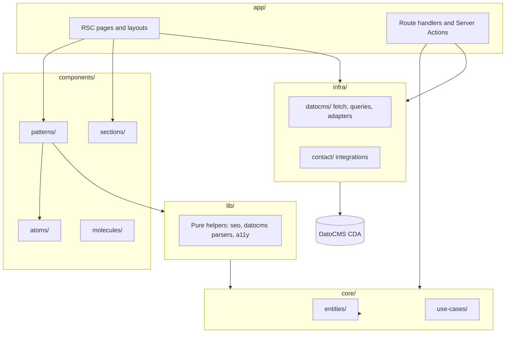

# Architecture (next-dato)

Next.js 16 App Router boilerplate with DatoCMS, Clean Architecture–inspired layers, and strict separation between UI, domain logic, and CMS infrastructure.

## Layer overview



## Directory map

| Path | Responsibility |
|------|----------------|
| `src/app/` | Routes, layouts, `generateMetadata`, error boundaries, Server Actions entry |
| `src/components/atoms/` | Primitives (`Button`, `Input`, `Container`) — minimal logic |
| `src/components/molecules/` | Composed UI (Field) |
| `src/components/patterns/` | Reusable CMS-aware UI (header, ST renderer, blocks shared across pages) |
| `src/components/sections/` | Full-width page sections (e.g. CTA Banner) when distinct from patterns |
| `src/lib/` | Framework-agnostic helpers (SEO builders, `readCda*`, link resolution, nonce) |
| `src/core/` | Domain entities and use-cases — **no React/Next imports** |
| `src/infra/` | External I/O: DatoCMS client, GraphQL queries, email/CRM adapters |
| `src/constants/` | Shared constants (i18n, theme, security headers) |
| `src/config/` | App configuration (theme CSS variables) |
| `src/proxy.ts` | CSP, nonce, locale header, security headers |

## Data flow (CMS pages)

1. **Fetch**: `src/infra/datocms/get-page.ts` runs `PAGE_BY_SLUG` from [`queries.ts`](../src/infra/datocms/queries.ts).
2. **Normalize**: `normalizePageBySlugResult()` in [`types-page.ts`](../src/infra/datocms/types-page.ts).
3. **Render**: Page RSC → `CmsPageArticle` → hero + `PageContentBlocks`.
4. **Modular Content**: `PageContentBlocks` → `StructuredTextBlockView` → block components (`FaqGroupBlock`, `CtaBannerBlock`, etc.).
5. **Cache**: tags em `datocmsFetch`; publicação no Dato chama [`POST /api/revalidate`](../src/app/api/revalidate/route.ts) ([DATOCMS.md](./DATOCMS.md)).

Runtime queries live in `queries.ts`. Codegen input lives in `src/infra/datocms/graphql/*.graphql` → `generated/operations.types.ts`.

**Do not edit** `src/infra/datocms/generated/**` by hand — run `npm run codegen`.

## Block rendering pipeline

```
Page.contentPage (CDA, Modular Content)
  └─ PageContentBlocks
       └─ StructuredTextBlockView
            ├─ FeatureGridRecord → FeatureGridBlock
            ├─ FaqGroupRecord → FaqGroupBlock (async RSC + client accordion)
            └─ CtaBannerRecord → CtaBannerBlock
```

Posts continuam em Structured Text: `StructuredTextView` → `StructuredTextBlockView` (imagem / galeria / vídeo).

Register new **page** blocks in [`structured-text-block-view.tsx`](../src/components/patterns/structured-text-block-view.tsx) and in the `contentPage` allowlist (query + schema Dato).

## SEO pipeline

| Concern | Location |
|---------|----------|
| Page metadata | `generateMetadata` + `buildDatoPageMetadata()` |
| Static metadata | `export const metadata` + `buildMetadata()` |
| JSON-LD site graph | `layout.tsx` → `buildSiteJsonLdGraph()` |
| Page JSON-LD | `CmsPageArticle` → `JsonLdScriptSync` |
| FAQ / block JSON-LD | Async block + `JsonLdScriptSync` with nonce |
| Sitemap / robots / manifest | `src/app/sitemap.ts`, `robots.ts`, `manifest.ts` |

See [QUALITY-GATES.md](./QUALITY-GATES.md) (SEO/AEO pillars) and [AI-PLAYBOOK.md](./AI-PLAYBOOK.md).

## Security boundary

- CSP and nonce: [`src/proxy.ts`](../src/proxy.ts)
- Server-only tokens: `DATOCMS_*`, `DATOCMS_PREVIEW_SECRET`
- Draft mode: [`src/app/api/draft/`](../src/app/api/draft/)
- Details: [SECURITY.md](./SECURITY.md), `.cursor/rules/security.mdc`

## Import rules

- `core/` must not import from `app/`, `components/`, or `infra/`.
- `infra/` must not import React components.
- Prefer `lib/datocms/*` for CMS field parsing shared between server components.
- Client components (`"use client"`) only where interactivity is required.
