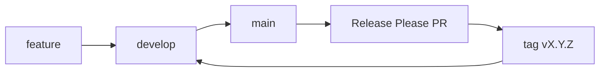

# GitHub — next-dato

Guia operacional das configurações do repositório (Actions, proteção de branches, Release Please). Commits e títulos de PR: [`.cursor/rules/git-conventions.mdc`](../.cursor/rules/git-conventions.mdc). Secrets de CI: [SECURITY.md](./SECURITY.md).

## Branches

| Branch | Papel | Duração |
|--------|--------|---------|
| `main` | Produção (default) | Permanente |
| `develop` | Integração | Permanente |
| `qa` | Ambiente de QA | Permanente |
| `feat/…` | Trabalho | Apagar após merge |
| `release-please--branches--main--…` | PR de versão | Apagar após merge |

As tags (`v0.2.0`) são o versionamento. Não criar branches de backup por versão.

1. Feature → PR para `develop` (CI, Lighthouse, security, smoke).
2. Quando estável, PR `develop` → `main`.
3. Push em `main` dispara [`.github/workflows/release.yml`](../.github/workflows/release.yml). O bot abre o PR `chore(main): release next-dato X.Y.Z`.
4. Merge **desse** PR em `main` cria a tag e a GitHub Release.
5. Sincronizar `main` → `develop` (CHANGELOG / `package.json` / manifest).

Release Please corre **só** em `main`. Não configurar o mesmo workflow em `develop` ou `qa`.

## Settings → Actions → General

Obrigatório para o Release Please (usa `secrets.GITHUB_TOKEN`, sem PAT extra):

1. **Workflow permissions:** Read and write permissions.
2. Marcar **Allow GitHub Actions to create and approve pull requests**.

Sem a checkbox 2 o job falha com: `GitHub Actions is not permitted to create or approve pull requests`. O branch de release pode já existir; um **Re-run failed jobs** abre o PR depois de gravar a opção.

Se o PR do `github-actions[bot]` ficar em **workflows awaiting approval**, o bot conta como first-time contributor. Aprovar uma vez no PR, ou em *Approval for running fork pull request workflows from contributors* escolher **Require approval for first-time contributors who are new to GitHub**.

## Settings → General → Pull Requests

- **Automatically delete head branches:** ligado. Apaga `feat/…` e `release-please--branches--…` após o merge.
- Não apaga `main` (default) nem `develop`/`qa` enquanto **Allow deletions** estiver desmarcado nas regras de proteção.

## Settings → Branches

Required status checks (PRs para `main`, `develop` e `qa`): `quality`, `lighthouse (desktop)`, `lighthouse (mobile)`, `security`, `smoke`.

| Regra | Require PR | Status checks | Allow deletions | Allow force pushes | Do not allow bypassing |
|-------|------------|---------------|-----------------|--------------------|------------------------|
| `main` | Sim | Os cinco acima + conversation resolution | Não | Não | **Sim** |
| `develop` | Sim | Os cinco acima | Não | Não | Sim se a equipa for >1 |
| `qa` | Sim | Os cinco acima em PRs | Não | Não | Pode ficar aberto |

Com **Do not allow bypassing** ligado, o owner também não faz `git push origin <branch>` nem merge sem os checks. Com bypass aberto na `qa`, um push directo de admin **não** espera workflows; só o caminho PR espera.

## Workflows

| Ficheiro | Disparo | Job(s) |
|----------|---------|--------|
| [`.github/workflows/ci.yml`](../.github/workflows/ci.yml) | push / PR | `quality` |
| [`.github/workflows/security.yml`](../.github/workflows/security.yml) | push / PR | `security` |
| [`.github/workflows/lighthouse.yml`](../.github/workflows/lighthouse.yml) | PR | `lighthouse` (desktop + mobile) |
| [`.github/workflows/e2e.yml`](../.github/workflows/e2e.yml) | PR | `smoke` |
| [`.github/workflows/release.yml`](../.github/workflows/release.yml) | push em `main` | `release-please` |

Gates locais: [QUALITY-GATES.md](./QUALITY-GATES.md).
