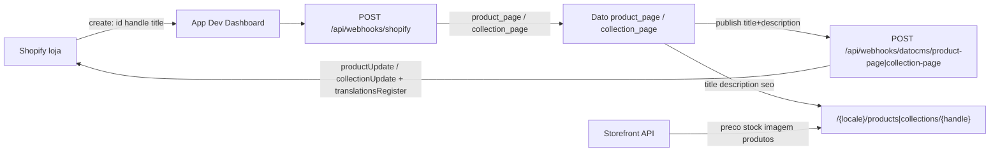

# Shopify — next-dato

O site **não** é a loja Shopify. A Shopify é a fonte de catálogo; o Dato guarda a ficha editorial; o Next renderiza o PDP.

Playbook Dato (modelo `product_page`, cache): [DATOCMS.md](./DATOCMS.md). Secrets / CSP: [SECURITY.md](./SECURITY.md). Variáveis: [`.env.example`](../.env.example).

## O que o site faz



| Peça | Papel |
|------|--------|
| App no **Dev Dashboard** | Client ID + chave secreta; **webhooks** assinados com essa chave |
| Canal **Headless** | Tokens da Storefront API (público + privado) |
| Dato `product_page` | `title`, `description`, `seo`; chaves `shopify_handle` + `shopify_product_id` |
| Dato `collection_page` | Igual, com `shopify_collection_id`. Sem links para produtos. Grelha da PLP: Storefront |
| Page de catálogo | Global settings `products_page` e `collections_page` |
| Bloco `content_listing_section` | `listing_config` é um single block Blog/Shopify. No `shopify_listing_config`, `fetch_mode=auto` usa `collection_filter` (catálogo completo ou coleção escolhida); `source_collection` só no segundo caso. Manual usa `selected_products`. Preço/imagem: Storefront com `@inContext(country)` (EN=`US`/USD, PT=`BR`/BRL, ES=`ES`/EUR) |
| Feature GRID (`card`) | `card_source` editorial, product ou collection. Product/collection: título Dato + imagem Storefront + href PDP/PLP (preço só no produto). Não é um listing. |
| Bloco Link (`type_content`) | Product / Collection apontam a `product_page` / `collection_page` (Hero, CTA, tabs, feature grid, pricing). Sem fetch Storefront no botão. |
| Next PDP / PLP | RSC: copy/SEO Dato + Storefront no **servidor** |
| Dato → Shopify | `title` + `description`: EN no produto; PT/ES na Translations API |

Fora de âmbito neste repo: `products/delete`, carrinho, checkout, `NEXT_PUBLIC_*` Shopify. Handle, preço, stock e imagem **não** vão do Dato para a Shopify.

## Duas superfícies Shopify (não misturar)

| Superfície | Onde | O que copias |
|------------|------|----------------|
| **Dev Dashboard** (`dev.shopify.com`) | App custom (ex. Automação DatoCMS) | `SHOPIFY_CLIENT_ID`, `SHOPIFY_API_SECRET_KEY`, Admin API (`write_products`) |
| **Admin da loja** | Canal de vendas **Headless** | `SHOPIFY_STOREFRONT_ACCESS_TOKEN` (privado) |
| **Admin da loja** | Definições da loja | `SHOPIFY_STORE_DOMAIN` (`loja.myshopify.com`, sem `https://`) |

A página de **instalação** do Headless (`…/app_installations/app/headless-storefronts`) **não** mostra tokens. Abre o canal (**Abrir app** ou pesquisa → Headless).

O HMAC do webhook usa a **chave secreta da app**. Tokens Storefront **não** assinam o webhook.

`SHOPIFY_CLIENT_ID` é obrigatório no env (app configurada). O cálculo HMAC **não** usa o Client ID — só `SHOPIFY_API_SECRET_KEY` no corpo cru.

## Variáveis (todas privadas)

Nunca `NEXT_PUBLIC_SHOPIFY_*`. Na Vercel: Environment Variables **sem** “Expose to the browser”, Production (e Preview se precisares), depois **redeploy**.

| Variável | Origem | Uso |
|----------|--------|-----|
| `SHOPIFY_CLIENT_ID` | Dev Dashboard → Configurações do app | Identidade da app; client credentials Admin |
| `SHOPIFY_API_SECRET_KEY` | Dev Dashboard → Chave secreta (`shpss_…`) | HMAC webhook **e** client credentials Admin |
| `SHOPIFY_STORE_DOMAIN` | Loja (`*.myshopify.com`) | Storefront URL + OAuth Admin + `x-shopify-shop-domain` |
| `SHOPIFY_STOREFRONT_ACCESS_TOKEN` | Headless → API Storefront → **token privado** (`shpat_…`) | PDP: preço, stock, imagem |
| `SHOPIFY_ADMIN_ACCESS_TOKEN` | Opcional (teste) | Override estático. Em produção o Next pede o token sozinho (~24h, cache em memória) |
| `DATOCMS_USER_REVIEWS_CDA_TOKEN` | Dato (token **CMA**) | Upsert de `product_page`. **Não** uses `DATOCMS_API_TOKEN` (CDA) |
| `DATOCMS_REVALIDATE_SECRET` | Dato webhook Bearer | `/api/revalidate` **e** `/api/webhooks/datocms/product-page` |
| `DATOCMS_ENVIRONMENT` | Dato | Escolhe o ambiente. Default **`main`**. `develop` = sandbox (fork). |

O cliente Storefront envia `Shopify-Storefront-Private-Token` se o valor começar por `shpat_`; senão `X-Shopify-Storefront-Access-Token` (token público hex). Preferir o **privado** no servidor.

## Passo a passo na Shopify

### 1. App no Dev Dashboard

1. [Dev Dashboard](https://dev.shopify.com) → a app instalada **nesta** loja.
2. Copia **ID do cliente** e **chave secreta** para `.env` / Vercel.
3. Scopes úteis (já na app se a criaste para catálogo): `unauthenticated_read_product_listings`, `unauthenticated_read_product_inventory` (Storefront via app) e o que for preciso para webhooks de produto.
4. Instala a app na loja de trabalho se ainda não estiver (1 instalação).

Não precisas de Admin access token permanente no Next.

### 2. Webhooks `products/create` e `products/update`

Fonte de verdade: [`shopify.app.toml`](../shopify.app.toml) na raiz. **Não** configures isto em Definições da loja → Notificações, **nem** em Project settings → Webhooks do Dato, **nem** no campo **URL do app** no Dev Dashboard.

| Onde | O quê |
|------|--------|
| `application_url` | Site: `https://enterprise-next-datocms.vercel.app` |
| `[[webhooks.subscriptions]]` | Tópicos + `uri` (relativo `/api/webhooks/shopify` ou URL absoluta HTTPS) |
| `[webhooks] api_version` | Formato do payload (ex. `2026-07`) |

O `link` pode reescrever a URI absoluta para o path relativo; a Shopify resolve contra `application_url`.

```bash
# Uma vez por clone (liga o repo à app Automação DatoCMS - NextJS)
npx shopify app config link --client-id "$SHOPIFY_CLIENT_ID"

# Sempre que mudares tópicos, URI ou scopes no toml
npx shopify app deploy
```

O ecrã **Criar versão** no Dashboard só cobre URL da app e versão da API. Sem `deploy` do TOML, guardar um produto na Shopify **não** chama o Next.

Webhooks em **Definições da loja → Notificações** usam **outro** signing secret → HMAC `401` com `SHOPIFY_API_SECRET_KEY`.

| Campo | Valor |
|-------|--------|
| URI | `/api/webhooks/shopify` (resolvido para `https://enterprise-next-datocms.vercel.app/api/webhooks/shopify`) |
| Tópicos | `products/create`, `products/update`, `collections/create`, `collections/update` |
| Formato | JSON |
| Versão da API | a do toml (`2026-07`) |

Local: `localhost` só com túnel HTTPS **e** essa URL no toml + `deploy`.

O endpoint exige HTTPS público. `localhost` só funciona atrás de um túnel (Cloudflare Tunnel, ngrok) **e** com essa URL registada na app.

A rota Shopify → Dato: HMAC do **corpo cru** → loja igual a `SHOPIFY_STORE_DOMAIN` → tópico produto → parse `id` / `handle` / `title` → CMA upsert + publish. **Create** preenche `title` nos 3 locales; **update** só `shopify_handle` + `shopify_product_id` (não sobrescreve o título editorial).

O webhook Dato **Next.js revalidate** (`POST /api/revalidate`) só invalida cache. O título Dato → Shopify é **outro** webhook (passo 4b).

Respostas Shopify: **500** env em falta; **401** HMAC, loja ou tópico inválidos; **400** JSON/payload; **200** `{ "success": true }`.

### 2b. Backfill dos produtos já existentes

As subscrições só disparam em **alterações futuras**. Produtos criados antes do `deploy` não entram sozinhos — ou os editas um a um na Shopify, ou corres o backfill:

```bash
npm run shopify:backfill -- --url https://enterprise-next-datocms.vercel.app --dry-run
npm run shopify:backfill -- --url https://enterprise-next-datocms.vercel.app
npm run shopify:backfill:collections -- --url https://enterprise-next-datocms.vercel.app --dry-run
npm run shopify:backfill:collections -- --url https://enterprise-next-datocms.vercel.app
```

Lista os produtos pela Storefront API e reenvia cada um como webhook **assinado** para `/api/webhooks/shopify`. Mesmo caminho da Shopify, logo o mesmo upsert + publish — sem lógica CMA duplicada.

Só entram produtos publicados no canal **Headless** (a Storefront API não vê os outros). Corre-o depois do passo 3.

### 3. Canal Headless (Storefront)

1. Admin da loja → App Store → [Headless](https://apps.shopify.com/headless) → instalar.
2. Barra esquerda **Canais de vendas → Headless** (ou pesquisa). Não fiques na ficha de instalação.
3. **Criar vitrine** / Create storefront (instalar o canal **não** gera tokens).
4. **Gerenciar acesso à API → API Storefront**.
5. Copia o **token de acesso privado** (`shpat_…`) para `SHOPIFY_STOREFRONT_ACCESS_TOKEN`.
6. Publica os produtos no canal **Headless** (igual à Loja virtual). Sem isto a API autentica e o produto vem vazio.

### 3b. Plugin “Shopify product” no Dato (opcional)

Não faz parte do fluxo de sincronização — o webhook não precisa dele. Serve só para um editor **escolher** um produto num campo (pré-visualização com imagem e preço no editor).

| Campo do plugin | Valor |
|-----------------|--------|
| Use demo store? | desligado |
| **Shop ID** | **só o subdomínio**: `teste-datocms-ezequiel` (⚠️ não o `*.myshopify.com` completo) |
| Storefront access token | token **público** do canal Headless (hex). O privado `shpat_…` **não** serve: o plugin corre no browser |
| Auto-apply to fields | regex do API identifier, ex. `shopify_product` |

`The API key seems to be invalid for the specified Shopify domain!` é quase sempre o **Shop ID** com o domínio inteiro, ou um token privado onde tem de ser o público.

O `product_page` tem `title`, `description`, `seo`, `shopify_handle` e `shopify_product_id`. Handle e ID são chaves; o editor não deve alterá-los (fieldset **Shopify identifiers**). Title e description (fieldset **Shopify content**) sincronizam com a Shopify. Se quiseres o seletor visual, cria um campo novo com API identifier `shopify_product`; não substituas `shopify_handle`.

### 4. Dato (já no schema deste repo)

- Modelo `product_page` (migrations até `1789570457_…`) e `collection_page` (`1789600000_collectionPageShopifyCopySeo.ts`) no sandbox **`develop`** até o promote.
- Singleton Global settings → `products_page` e `collections_page`.
- Token CMA: Editor a escrever/publicar `product_page` **e** `collection_page`.
- **`DATOCMS_ENVIRONMENT` escolhe o ambiente.** Schema de catálogo neste ciclo: **`develop`**. Se omitires, o código cai em `main`.
- **Create** Shopify → Dato: `title` e `description` nos 3 locales = copy EN. Handles `frontpage` / `home-page` não criam `collection_page`.
- **Update** Shopify → Dato: `title.en` / `description.en` só se mudou; `pt-BR`/`es` só via Translations. Locales vazios mantêm-se no payload CMA.
- URLs: `/{locale}/products/{handle}` e `/{locale}/collections/{handle}`. Produtos da coleção: Storefront, não links no Dato.
- Listagem em landing/páginas: bloco modular **Content listing section**. Em `listing_config`, escolha **Shopify listing configuration**; `fetch_mode=auto` com `collection_filter=all` lista o catálogo e `selected` filtra pela `source_collection` (obrigatória editorialmente; vazia = empty state). Manual usa `selected_products`. **Blog listing configuration** concentra posts, categorias e ordenação no seu próprio bloco.
- Destaques pontuais: **Feature GRID** → CARD com `card_source` Product ou Collection (não usar o listing para um único produto).
- Não alargar as fichas com galeria, preço ou tags.

### 4b. Dato ↔ Shopify (título e descrição EN / PT / ES)

Criar produto **sempre na Shopify** (gera `shopify_product_id` + `shopify_handle`). Não cries `product_page` à mão sem esses campos.

1. Scopes em [`shopify.app.toml`](../shopify.app.toml): `write_products`, `read_locales`, `read_translations`, `write_translations` → `npx shopify app deploy` → **atualizar/reinstalar** a app na loja. Sem o `deploy` **e** o update na loja, o token continua com os scopes antigos (só leitura) e o `productUpdate` é recusado.
2. **Não** coloques um token Admin na Vercel. Client credentials com `SHOPIFY_CLIENT_ID` + `SHOPIFY_API_SECRET_KEY` + `SHOPIFY_STORE_DOMAIN`. `SHOPIFY_ADMIN_ACCESS_TOKEN` só para testes. **Não** guardes o token no Global setting.
3. Se o OAuth devolver `shop_not_permitted`, app e loja não estão na mesma organização do Dev Dashboard.
4. Webhooks Dato: URL `…/api/webhooks/datocms/product-page` (Product page) e `…/api/webhooks/datocms/collection-page` (Collection page), Bearer `DATOCMS_REVALIDATE_SECRET`, Record **update** + **publish**.
5. **EN:** Dato `title.en` ↔ Shopify `product.title`; Dato `description.en` ↔ descrição (`descriptionHtml` / `body_html`). **PT/ES:** Dato `pt-BR`/`es` ↔ translations `pt`/`es` (título + `body_html`). Sem tradução automática. HTML da Shopify é achatado a texto no campo `description`.
6. Publicar no Dato com títulos e descrições iguais aos da Shopify → `{ "success": true, "skipped": true }`.
7. EN é obrigatório; PT/ES são best-effort. Se faltarem os scopes de tradução, a resposta é `200` com `warnings` (o EN passa na mesma e o Dato não fica a repetir o webhook).

#### Webhook Dato em “Rescheduled” / `500 {"error":"Sync failed"}`

`detail` na resposta traz a mensagem da Shopify. `Access denied … write_products` = scopes concedidos desatualizados. Confirma os scopes **do token**, não os do TOML:

```bash
curl -s -X POST "https://$SHOPIFY_STORE_DOMAIN/admin/oauth/access_token" \
  -d grant_type=client_credentials \
  -d client_id="$SHOPIFY_CLIENT_ID" \
  -d client_secret="$SHOPIFY_API_SECRET_KEY" | jq '.scope'
```

Se o `scope` não incluir `write_products`, `read_locales`, `read_translations` e `write_translations`: `npx shopify app deploy` e depois **Apps → a app → atualizar** na loja (a Shopify pede a aprovação dos scopes novos). Só depois é que o Dato → Shopify funciona.

## Vercel

1. Settings → Environment Variables.
2. `SHOPIFY_CLIENT_ID`, `SHOPIFY_API_SECRET_KEY`, `SHOPIFY_STORE_DOMAIN`, `SHOPIFY_STOREFRONT_ACCESS_TOKEN` + `DATOCMS_USER_REVIEWS_CDA_TOKEN` + `DATOCMS_REVALIDATE_SECRET`. `SHOPIFY_ADMIN_ACCESS_TOKEN` não é preciso em produção. `DATOCMS_ENVIRONMENT=develop` enquanto o schema de catálogo viver no sandbox.
3. Production (e Preview).
4. Redeploy. Variável nova não entra no deploy já feito.

Local: as mesmas chaves no `.env` (nunca commitado).

**Não** configures `NODE_TLS_REJECT_UNAUTHORIZED` na Vercel, no Next, no `.env` da app, nem no CI. O site e o webhook **não** usam essa variável.

### CLI Shopify — TLS local (`self-signed certificate in certificate chain`)

Só o **Shopify CLI** (`npx shopify …`) no teu Mac, se um proxy/antivirus interceptar HTTPS para `accounts.shopify.com`. Não é setting do projeto.

```bash
NODE_TLS_REJECT_UNAUTHORIZED=0 npx shopify app config link --client-id "$SHOPIFY_CLIENT_ID"
NODE_TLS_REJECT_UNAUTHORIZED=0 npx shopify app deploy
```

Prefixo **só nesse comando**. Não exportes a variável no shell de forma permanente. O caminho certo a médio prazo é instalar o certificado da cadeia (ou desligar a inspeção TLS) — `REJECT_UNAUTHORIZED=0` desliga a verificação SSL.

`npx datocms`, `npm run dev`, testes e Vercel **não** precisam disto.

## Verificar

1. Cria um produto na Shopify → no Dato aparece `product_page` (handle + id + título EN nos 3 locales), publicado.
2. Edita `title` **en** no Dato e publica → o título default na Admin Shopify atualiza. O mesmo para `description` ↔ Descrição.
3. Edita `pt-BR` / `es` no Dato e publica → título e descrição aparecem em Translate & Adapt / Markets PT e ES.
4. Edita o título default **na Shopify** → o Dato atualiza só `en`; `pt-BR` e `es` mantêm-se.
5. Abre `/{locale}/products` e um PDP: EN mostra USD, PT BRL, ES EUR (Markets US/BR/ES na Storefront `@inContext(country)`). Sem Market para o país, a API devolve a moeda default da loja.
6. Abre `https://<site>/<locale>/products/<handle>`: título Dato desse locale; preço/imagem da Storefront.
7. Preenche `description` / `seo` num locale no Dato e publica → o PDP desse idioma mostra a copy; preço e foto continuam da Shopify.

## Código

| Caminho | Função |
|---------|--------|
| `shopify.app.toml` | tópicos produto + coleção; `write_products`, translations |
| `scripts/backfill-shopify-products.mjs` | Backfill produtos |
| `scripts/backfill-shopify-collections.mjs` | Backfill coleções (`npm run shopify:backfill:collections`) |
| `src/app/api/webhooks/shopify/route.ts` | Shopify → Dato (produto e coleção) |
| `src/app/api/webhooks/datocms/product-page/route.ts` | Dato → produto Shopify |
| `src/app/api/webhooks/datocms/collection-page/route.ts` | Dato → coleção Shopify |
| `src/infra/datocms/sync-collection-page.ts` | CMA upsert `collection_page` |
| `src/infra/shopify/admin-collection-copy.ts` | `collectionUpdate` + `translationsRegister` |
| `src/app/[slug]/collections/[handle]/page.tsx` | PLP |
| `src/lib/shopify/hmac.ts` | HMAC SHA-256 Base64, `timingSafeEqual` |
| `src/lib/shopify/parse-product-webhook.ts` | Payload produto Shopify |
| `src/lib/datocms/parse-product-page-title-sync.ts` | Payload Dato `product_page` |
| `src/infra/datocms/sync-product-page.ts` | CMA upsert (EN no update se mudou) |
| `src/lib/shopify/locale-map.ts` | Dato `pt-BR`/`es` → Shopify `pt`/`es` |
| `src/lib/shopify/admin-access-token.ts` | Client credentials + cache Admin |
| `src/infra/shopify/admin-product-title.ts` | `productUpdate` + `translationsRegister` |
| `src/infra/shopify/storefront.ts` | GraphQL Storefront `2024-07` |
| `src/app/[slug]/products/[handle]/page.tsx` | PDP |

Docs Shopify: [Storefront getting started](https://shopify.dev/docs/storefronts/headless/building-with-the-storefront-api/getting-started), [Get API access tokens](https://shopify.dev/docs/apps/build/dev-dashboard/get-api-access-tokens).
