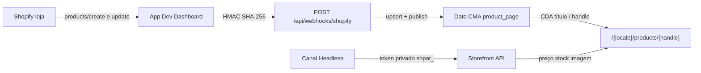

# Shopify — next-dato

O site **não** é a loja Shopify. A Shopify é a fonte de catálogo; o Dato guarda a ficha editorial; o Next renderiza o PDP.

Playbook Dato (modelo `product_page`, cache): [DATOCMS.md](./DATOCMS.md). Secrets / CSP: [SECURITY.md](./SECURITY.md). Variáveis: [`.env.example`](../.env.example).

## O que o site faz

| Peça | Papel |
|------|--------|
| App no **Dev Dashboard** | Client ID + chave secreta; **webhooks** assinados com essa chave |
| Canal **Headless** | Tokens da Storefront API (público + privado) |
| Dato `product_page` | Título + `shopify_handle` + `shopify_product_id` (webhook CMA) |
| Page de catálogo | Ligada em Global settings (`products_page`) |
| Next PDP | RSC: Dato + Storefront no **servidor** |

Fora de âmbito neste repo: `products/delete`, carrinho, checkout, token Admin legado (`SHOPIFY_ADMIN_ACCESS_TOKEN`), `NEXT_PUBLIC_*` Shopify.

## Duas superfícies Shopify (não misturar)

| Superfície | Onde | O que copias |
|------------|------|----------------|
| **Dev Dashboard** (`dev.shopify.com`) | App custom (ex. Automação DatoCMS) | `SHOPIFY_CLIENT_ID`, `SHOPIFY_API_SECRET_KEY` |
| **Admin da loja** | Canal de vendas **Headless** | `SHOPIFY_STOREFRONT_ACCESS_TOKEN` (privado) |
| **Admin da loja** | Definições da loja | `SHOPIFY_STORE_DOMAIN` (`loja.myshopify.com`, sem `https://`) |

A página de **instalação** do Headless (`…/app_installations/app/headless-storefronts`) **não** mostra tokens. Abre o canal (**Abrir app** ou pesquisa → Headless).

O HMAC do webhook usa a **chave secreta da app**. Tokens Storefront **não** assinam o webhook.

`SHOPIFY_CLIENT_ID` é obrigatório no env (app configurada). O cálculo HMAC **não** usa o Client ID — só `SHOPIFY_API_SECRET_KEY` no corpo cru.

## Variáveis (todas privadas)

Nunca `NEXT_PUBLIC_SHOPIFY_*`. Na Vercel: Environment Variables **sem** “Expose to the browser”, Production (e Preview se precisares), depois **redeploy**.

| Variável | Origem | Uso |
|----------|--------|-----|
| `SHOPIFY_CLIENT_ID` | Dev Dashboard → Configurações do app | Obrigatório; identidade da app |
| `SHOPIFY_API_SECRET_KEY` | Dev Dashboard → Chave secreta (`shpss_…`) | HMAC `x-shopify-hmac-sha256` |
| `SHOPIFY_STORE_DOMAIN` | Loja (`*.myshopify.com`) | Storefront URL + header `x-shopify-shop-domain` |
| `SHOPIFY_STOREFRONT_ACCESS_TOKEN` | Headless → API Storefront → **token privado** (`shpat_…`) | PDP: preço, stock, imagem |
| `DATOCMS_USER_REVIEWS_CDA_TOKEN` | Dato (token **CMA**) | Upsert de `product_page`. **Não** uses `DATOCMS_API_TOKEN` (CDA) |

O cliente Storefront envia `Shopify-Storefront-Private-Token` se o valor começar por `shpat_`; senão `X-Shopify-Storefront-Access-Token` (token público hex). Preferir o **privado** no servidor.

## Passo a passo na Shopify

### 1. App no Dev Dashboard

1. [Dev Dashboard](https://dev.shopify.com) → a app instalada **nesta** loja.
2. Copia **ID do cliente** e **chave secreta** para `.env` / Vercel.
3. Scopes úteis (já na app se a criaste para catálogo): `unauthenticated_read_product_listings`, `unauthenticated_read_product_inventory` (Storefront via app) e o que for preciso para webhooks de produto.
4. Instala a app na loja de trabalho se ainda não estiver (1 instalação).

Não precisas de Admin access token permanente no Next.

### 2. Webhooks `products/create` e `products/update`

Configura os tópicos **na app** (Dev Dashboard / `shopify.app.toml` da app), **não** em Definições → Notificações da loja.

Webhooks criados em **Definições da loja → Notificações** usam **outro** signing secret. Se os usares, o HMAC falha com a chave do Dev Dashboard.

| Campo | Valor |
|-------|--------|
| URL | `https://<domínio-público>/api/webhooks/shopify` |
| Tópicos | `products/create`, `products/update` |
| Formato | JSON |
| Versão da API | alinhada com a app (ex. `2024-07` ou a que a app declarar) |

O endpoint exige HTTPS público. `localhost` só funciona atrás de um túnel (Cloudflare Tunnel, ngrok) **e** com essa URL registada na app.

A rota: HMAC do **corpo cru** → loja igual a `SHOPIFY_STORE_DOMAIN` → tópico produto → parse `id` / `handle` / `title` → CMA upsert + publish.

Respostas: **500** env em falta; **401** HMAC, loja ou tópico inválidos; **400** JSON/payload; **200** `{ "success": true }`.

### 3. Canal Headless (Storefront)

1. Admin da loja → App Store → [Headless](https://apps.shopify.com/headless) → instalar.
2. Barra esquerda **Canais de vendas → Headless** (ou pesquisa). Não fiques na ficha de instalação.
3. **Criar vitrine** / Create storefront (instalar o canal **não** gera tokens).
4. **Gerenciar acesso à API → API Storefront**.
5. Copia o **token de acesso privado** (`shpat_…`) para `SHOPIFY_STOREFRONT_ACCESS_TOKEN`.
6. Publica os produtos no canal **Headless** (igual à Loja virtual). Sem isto a API autentica e o produto vem vazio.

### 4. Dato (já no schema deste repo)

- Modelo `product_page` (migration `1789399000_productPageAndProductsPageLink.ts`).
- Singleton Global settings → `products_page` (link para a Page de catálogo).
- Token CMA (`DATOCMS_USER_REVIEWS_CDA_TOKEN`): Content Management API + Editor a escrever/publicar `product_page` (não só `user_review`).
- Ambiente: se o Next usa `DATOCMS_ENVIRONMENT`, o CMA do webhook aponta para o mesmo.

O webhook preenche `title` em `en`, `pt-BR` e `es`. O handle não é localizado. URL do PDP: `/{locale}/products/{handle}` (`en`, `pt`, `es`).

## Vercel

1. Settings → Environment Variables.
2. As quatro `SHOPIFY_*` + CMA Dato, **privadas**.
3. Production (e Preview).
4. Redeploy. Variável nova não entra no deploy já feito.

Local: as mesmas chaves no `.env` (nunca commitado).

## Verificar

1. Cria ou edita um produto na Shopify → no Dato deve aparecer/atualizar `product_page` (handle + id).
2. Abre `https://<site>/<locale>/products/<handle>`: título Dato; preço/imagem se o token Headless e a publicação no canal estiverem certos.
3. Logs Vercel: HMAC 401 → secret da **app** vs webhook da **loja**; 500 `missing` → env; produto sem preço → Headless / publicação no canal.

## Código

| Caminho | Função |
|---------|--------|
| `src/app/api/webhooks/shopify/route.ts` | Webhook |
| `src/lib/shopify/hmac.ts` | HMAC SHA-256 Base64, `timingSafeEqual` |
| `src/lib/shopify/parse-product-webhook.ts` | Payload produto |
| `src/infra/datocms/sync-product-page.ts` | CMA upsert |
| `src/infra/shopify/storefront.ts` | GraphQL Storefront `2024-07` |
| `src/app/[slug]/products/[handle]/page.tsx` | PDP |

Docs Shopify: [Storefront getting started](https://shopify.dev/docs/storefronts/headless/building-with-the-storefront-api/getting-started), [Get API access tokens](https://shopify.dev/docs/apps/build/dev-dashboard/get-api-access-tokens).
